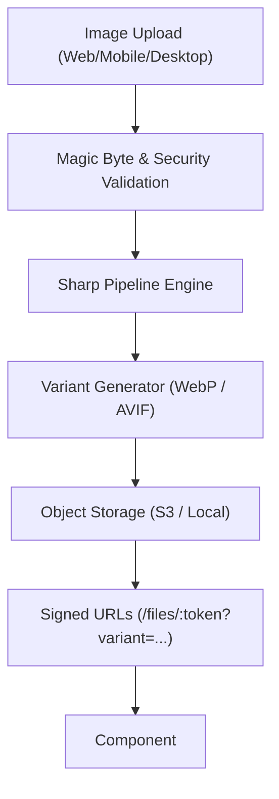

# Sharp Image Processing Architecture & Developer Guide

This document describes the image and media processing architecture across OneTab-AI, powered by the **Sharp** (`libvips`) engine.

---

## 1. Architecture Overview

All media processing is centralized in `@org/api-media-processing` (`libs/api/media-processing`) and integrated directly into the workspace upload and storage systems (`@org/api-storage`), the user avatar pipeline (`@org/api-user`), and the workspace logo pipeline (`@org/api-workspace`).



---

## 2. Core Features & Capabilities

### Supported Input & Output Formats
- **Input:** JPEG, PNG, WebP, GIF, AVIF, TIFF, SVG.
- **Output:** WebP (default modern delivery), AVIF, JPEG, PNG, GIF, TIFF.
- **Animations:** Animated WebP and GIF supported (`animated: true`).

### Security Controls
1. **Magic-Byte Sniffing:** Checks real byte signatures rather than relying on file extensions.
2. **Decompression Bomb Protection:** Pre-decode dimension checks prevent memory exhaustion (`MAX_PIXELS = 40,000,000`, `MAX_WIDTH/HEIGHT = 8,192`).
3. **SVG Security:** Rejects embedded `<script>`, inline event handlers (`onload`, `onclick`), XXE/entity expansion, `javascript:` URLs, and remote SSRF image links.
4. **Workspace Isolation:** All variants inherit the parent asset's `workspaceId` partition.
5. **Signed Content Tokens:** Time-bounded HMAC-SHA256 signatures grant variant access without exposing filesystem paths.

---

## 3. Available Presets

Standard presets are defined in `STANDARD_IMAGE_PRESETS`:

| Preset | Dimensions | Fit | Format | Quality | Use Case |
|---|---|---|---|---|---|
| `thumbnail` | 320x320 | `cover` | WebP | 80 | Chat attachments, files hub, lists |
| `small` | 480w | `inside` | WebP | 82 | Mobile previews |
| `medium` | 1024w | `inside` | WebP | 85 | Standard desktop viewer |
| `large` | 1920w | `inside` | WebP | 88 | Fullscreen lightbox |
| `avatar` | 256x256 | `cover` | WebP | 90 | User profile photo (sizes: 32, 48, 64, 96, 128, 256, 512) |
| `workspaceLogo` | 256x256 | `contain` | WebP | 90 | Workspace switcher & headers |
| `chatPreview` | 800x600 | `inside` | WebP | 85 | Inline chat attachments |
| `filePreview` | 1024x768 | `inside` | WebP | 85 | File manager detail card |

---

## 4. Backend Usage Examples

### Dependency Injection
```typescript
import { ImageProcessingService, ImageSecurityService } from '@org/api-media-processing';

@Injectable()
export class MyService {
  constructor(
    private readonly imageProcessing: ImageProcessingService,
    private readonly imageSecurity: ImageSecurityService,
  ) {}
}
```

### Inspecting Metadata (Without Decoding)
```typescript
const meta = await imageProcessing.getMetadata(imageBuffer);
console.log(meta.width, meta.height, meta.format, meta.mimeType, meta.aspectRatio);
```

### Resizing and Converting
```typescript
const result = await imageProcessing.resize(imageBuffer, {
  width: 800,
  height: 600,
  fit: 'cover',
  position: 'attention', // Smart focal point cropping
  withoutEnlargement: true,
});

// Returns: { buffer, format, mimeType, width, height, size, durationMs }
```

### Custom Pipeline Processing
```typescript
const output = await imageProcessing.process(imageBuffer, {
  autoOrient: true,
  crop: { left: 10, top: 10, width: 400, height: 400 },
  resize: { width: 300, height: 300 },
  sharpen: true,
  format: 'webp',
  quality: 85,
  stripMetadata: true,
});
```

### Multi-layer Compositing
```typescript
const branded = await imageProcessing.composite(baseBuffer, [
  {
    input: watermarkBuffer,
    gravity: 'southeast',
    blend: 'over',
    opacity: 0.7,
  },
]);
```

---

## 5. Delivery & Frontend Usage

### The `<PlatformImage />` Component
Imported from `@org/ui`:

```tsx
import { PlatformImage } from '@org/ui';

// Using a full Upload object (automatically uses responsive srcset):
<PlatformImage
  src={upload}
  variant="medium"
  alt="Project wireframe"
  className="w-full h-auto rounded-xl"
/>

// Using a thumbnail variant:
<PlatformImage
  src={upload}
  variant="thumbnail"
  alt="Preview"
  className="size-16 object-cover"
/>

// Using a string URL with custom fallback:
<PlatformImage
  src="/files/signed_token_123"
  variant="small"
  alt="Photo"
  fallback={<div className="p-4 text-xs text-muted-foreground">Unavailable</div>}
/>
```

---

## 6. Avatar Pipeline

When a user uploads a new avatar via `POST /api/v1/users/me/avatar`:
1. Magic bytes and integrity verified.
2. Sharp auto-orients from EXIF.
3. Cropped to square with `attention` smart centering.
4. Variants generated across standard sizes: 32x32, 48x48, 64x64, 96x96, 128x128, 256x256, 512x512.
5. All variants saved to object storage under `avatars/<userId>/avatar_<size>.webp`.
6. `User.avatarUrl` updated.
7. Synced to Matrix homeserver profile via Matrix bridge.

---

## 7. Migration / Backfill

To generate missing variants for historical uploads, run:

```bash
npx tsx scripts/backfill-image-variants.ts
```

The script is safe, idempotent, and resumable.
